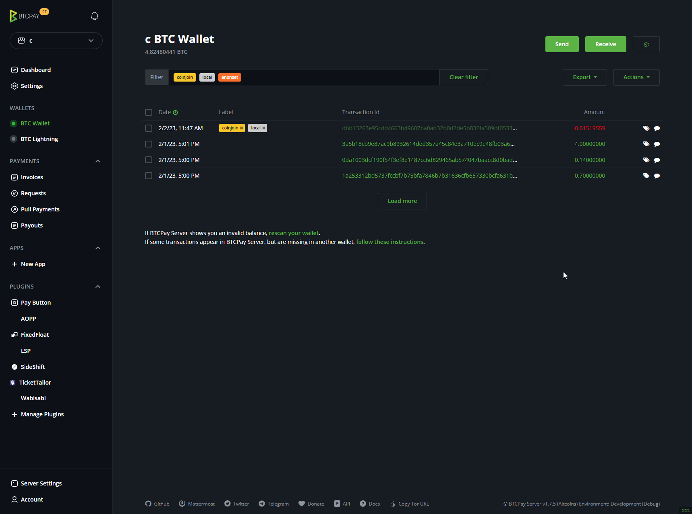
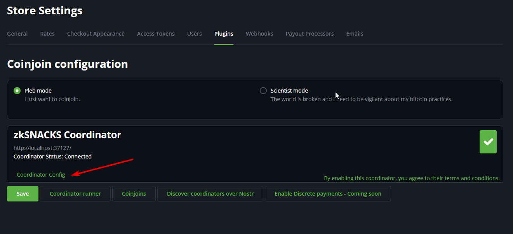
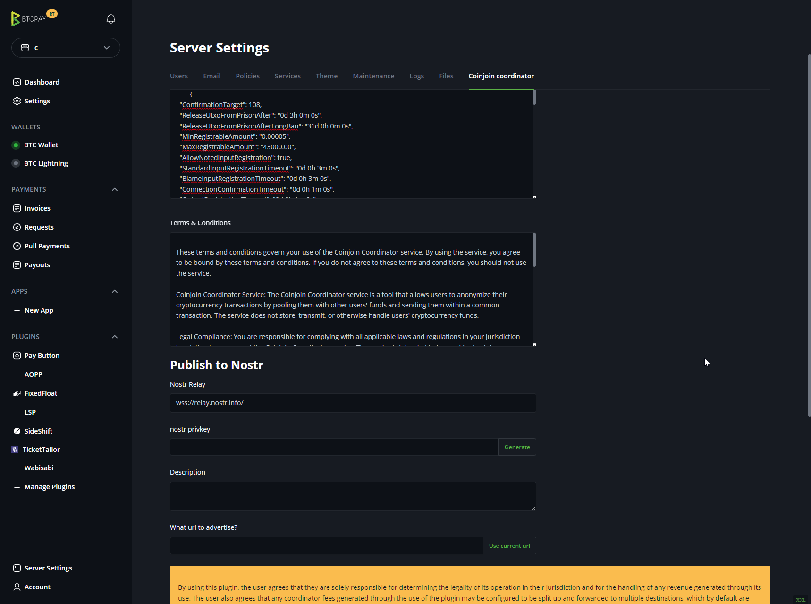
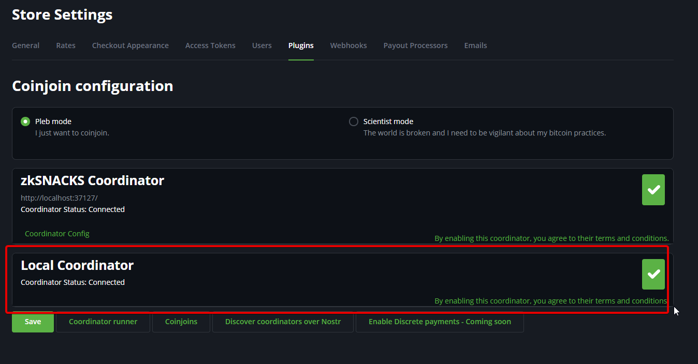

# The BTCPay Server Coinjoin plugin

This plugin allows every BTCPay Server instance to integrate with the Wabisabi coinjoin protocol developed by [zkSNACKS](https://zksnacks.com/) ([Wasabi Wallet](https://wasabiwallet.io/)).

## Installation

First ensure that your BTCPay Server instance is at least version 1.8.0 and that NBXplorer is at least 2.3.58. If you are using the recommended Docker deployment method, it is as simple as [one-click](https://docs.btcpayserver.org/FAQ/ServerSettings/#how-to-update-btcpay-server).

Then, you will need to log in as an admin, click on "Manage plugins" in the side navigation, and click on "Install" on the "Coinjoin" plugin in the list. BTCPay Server will then ask you to restart in order to load the plugin.

After the restart, there should be a new navigation item in the side navigation, "Coinjoin", and the dashboard should have additional elements related to coinjoins.

## Usage

Your store needs to have a Bitcoin wallet configured and it needs to be set up as a [hot wallet](https://docs.btcpayserver.org/CreateWallet/#hot-wallet). Only native segwit (and potentially taproot) wallets will be able to join coinjoin rounds.

The easiest way to get started is to click on "Coinjoin" in the side navigation, choose the default "zkSNACKS" coordinator and click "save". BTCPay Server will automatically join coinjoin rounds and progress to enhancing the privacy of your wallet.

Coinjoin transactions will appear in the transactions list in your wallet as they happen, and will have at least 2 labels, "coinjoin", and the name of the coordinator.

## Spending privately

Coins which have gained some level of privacy will have an "anonset" label when using the BTCPay wallet coin selection feature. If you hover over the label, it will tell you the score it has gained. 

It is up to you to use the coin selection feature correctly to make the best of your earned privacy on your coins.

Ideally you: 
* select the least amount of coins possible
* select the highest level of privacy coins
* ideally use coins from different transactions
* spend entire coins to prevent change

We realize this is a complex selection and are working on an easier UI to help with this. As an initial experiment, we have added an action to let us attempt to select coins based on your sending amounts.

But the best way to spend privately is to use our unique **payment batching feature**, by utilizing BTCPay Server's [Payout](https://docs.btcpayserver.org/Payouts/) system. Simply set the destination and amount and click on "Schedule transaction", and the payment will be embedded directly inside the next coinjoin that can fulfill it.

## Additional Coordinators

We realize that the weakest link in these coinjoin protocols is the centralized coordinator aspect, and so have opted to support multiple coordinators, in parallel, from the get-go. You can discover additional coordinators over Nostr.

Please be cautious as some coordinators may be malicious in nature. Once a coordinator has been added and a coinjoin round has been discovered, you can click on "Coordinator Config" to see what their fees and round requirements are set to.

Ideally, the minimum number of inputs is 50 and the fee is below 1% (the default is 0.3%).

## Running a coordinator

In the spirit of "be the change you want to see in the world", this plugin ships with the ability to run your own coordinator (and publish it over Nostr for discoverability). This feature is still considered experimental, and may have [legal repercussions for operating a coordinator](https://bitcoinmagazine.com/technical/is-bitcoin-next-after-tornado-cash).

By default, the coordinator is configured to donate its generated fees to the [human rights foundation](https://hrf.org/), and [opensats](https://opensats.org/). 

One enabled, the local coordinator appears in the coinjoin configuration of your store, and, if you configures the nostr settings, published to a relay so that others may discover the coordinator.

