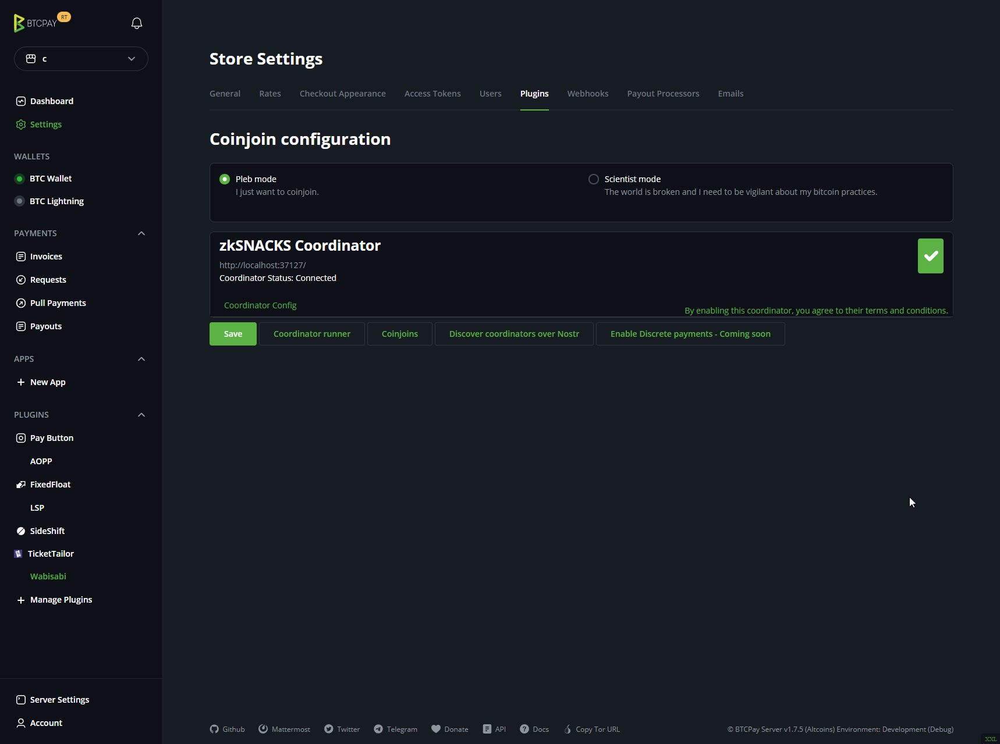
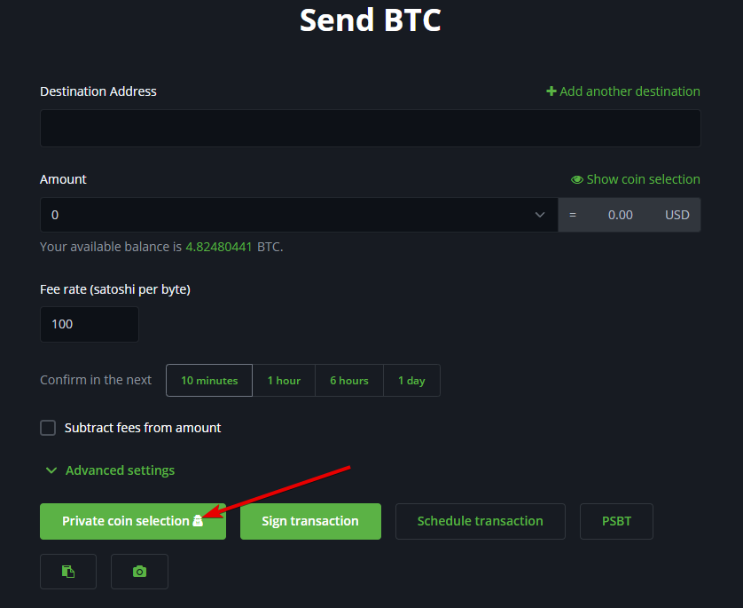
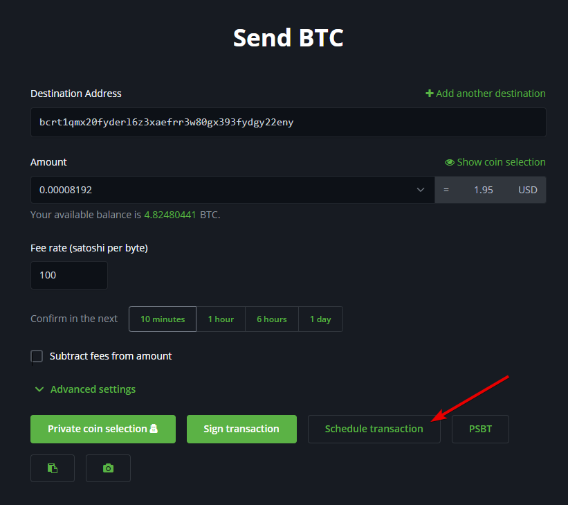
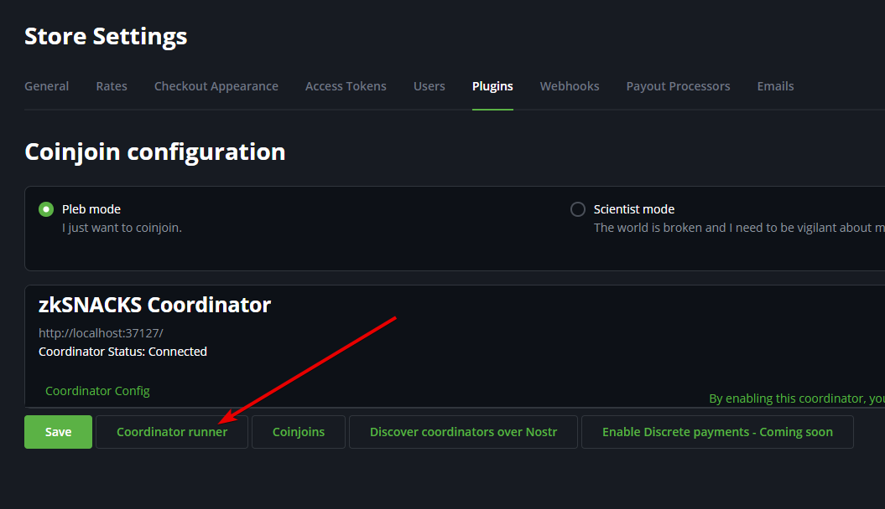

# The BTCPay Server Coinjoin plugin

This plugin allows every BTCPay Server instance to integrate with the Wabisabi coinjoin protocol developed by [zkSNACKS](https://zksnacks.com/) ([Wasabi Wallet](https://wasabiwallet.io/)).


<p align="center">
<a href="http://www.youtube.com/watch?feature=player_embedded&v=zGVCrwMKKn0
" target="_blank"></a>
</p>

## Installation

First ensure that your BTCPay Server instance is at least version 1.8.0 and that NBXplorer is at least 2.3.58. If you are using the recommended Docker deployment method, it is as simple as [one-click](docs/https://docs.btcpayserver.org/FAQ/ServerSettings/#how-to-update-btcpay-server).

Then, you will need to log in as an admin, click on "Manage plugins" in the side navigation, and click on "Install" on the "Coinjoin" plugin in the list. BTCPay Server will then ask you to restart in order to load the plugin.

After the restart, there should be a new navigation item in the side navigation, "Coinjoin", and the dashboard should have additional elements related to coinjoins.

## Usage

Your store needs to have a Bitcoin wallet configured and it needs to be set up as a [hot wallet](docs/https://docs.btcpayserver.org/CreateWallet/#hot-wallet). Only native segwit (and potentially taproot) wallets will be able to join coinjoin rounds.

The easiest way to get started is to click on "Coinjoin" in the side navigation, choose the default "zkSNACKS" coordinator and click "save". BTCPay Server will automatically join coinjoin rounds and progress to enhancing the privacy of your wallet.

Coinjoin transactions will appear in the transactions list in your wallet as they happen, and will have at least 2 labels, "coinjoin", and the name of the coordinator.


## Spending privately

Coins which have gained some level of privacy will have an "anonset" label when using the BTCPay wallet coin selection feature. If you hover over the label, it will tell you the score it has gained. 


It is up to you to use the coin selection feature correctly to make the best of your earned privacy on your coins.

Ideally you: 
* select the least amount of coins possible
* select the highest level of privacy coins
* ideally use coins from different transactions
* spend entire coins to prevent change

We realize this is a complex selection and are working on an easier UI to help with this. As an initial experiment, we have added an action to let us attempt to select coins based on your sending amounts.


But the best way to spend privately is to use our unique **payment batching feature**, by utilizing BTCPay Server's [Payout](docs/https://docs.btcpayserver.org/Payouts/) system. Simply set the destination and amount and click on "Schedule transaction", and the payment will be embedded directly inside the next coinjoin that can fulfill it.


## Pleb mode vs Scientist mode

Pleb mode comes with a curated set of configurations aimed to get you off the ground with coinjoining. Scientist mode is for those who want to experiment with different configurations and fine tune their coinjoin experience.

Scientist mode allows you to configure the following:
* Anonscore target: What level of privacy you want to achieve. The higher the number, the more privacy you will gain, but the longer (and more expensive due to mining fees) it will take to achieve it. The pleb mode default is 5.
* Coinsolidations: When this is turned on, the plugin will attempt to add many coins in comparison to usual. The maximum number of coins that can be added by this plugin is a random number computed for each round between 10 and 30. When coinsolidation mode is on, the likelihood to keep adding coins to the max number is probabilistic change of 90%, else it is current number of coins divided by the max number of coins. The pleb mode default is off.
* Batched payments: When this is turned on, the plugin will attempt to batch BTC on-chain Payouts that are in the `AwaitingPayment` state. Please note that if the coordinator you are connected to does not allow creating outputs of the payout's address format ( such as a non segwit or taproot address), these payments will not be processed. The pleb mode default is on.
* Cross mixing: Cross mixing allows you to mix your coins across multiple coordinators in parallel, bringing you the privacy benefits of multiple coordinator liquidity pools. The default option is `When Free` (pleb mode default), which means it will only remix coins on different coordinators if they are below the free threshold and will not be charged a coordinator fee. The other option is `Always`, which will mix coins across coordinators regardless of the fee. The last option is `Never`, which will not mix coins across coordinators.
* Continuous coinjoins: When this is turned on, the plugin will attempt to join coinjoins even if all your coins are private. The chance to join is a random chance as defined by the value divided by 100 and then as a percentage. This means that if you enter `100`, there is a 1% chance of coinjoining every round. The pleb mode default is 0.
* Send to other wallet: If you have other stores configured with an onchain wallet, with the same address format type, you can choose to send your coinjoin outputs to that wallet. This is useful if you want to keep your privacy gains separate from your main wallet, and can even send them directly to a hardware wallet! The pleb mode default is off.
* Label coin selection: You are able to specify which labels will allow or disallow coins from joining coinjoins. If you exclude labels A,B, and C, then coins with those labels will not be used in coinjoins. If you include labels D, E, and F, then only coins with either of those labels will be used in coinjoins.


## Additional Coordinators

We realize that the weakest link in these coinjoin protocols is the centralized coordinator aspect, and so have opted to support multiple coordinators, in parallel, from the get-go. You can discover additional coordinators over Nostr, or you can add a coordinator manually by using the link at the bottom.


Please be cautious as some coordinators may be malicious in nature. Once a coordinator has been added and a coinjoin round has been discovered, you can click on "Coordinator Config" to see what their fees and round requirements are set to, but be aware that a coordinator can change these at will. The plugin tracks if the minimum inputs per round, the coordination fee or the free threshold has changed and will not join rounds that are worse off than the one visible when you enabled the coordinator. You can accept the new terms by clicking on "Accept new terms" and the plugin will join rounds using the new parameters.


Ideally, the minimum number of inputs is 50 and the fee is below 1% (the default is 0.3%).

## Running a coordinator

In the spirit of "be the change you want to see in the world", this plugin ships with the ability to run your own coordinator (and publish it over Nostr for discoverability). This feature is still considered experimental, and may have [legal repercussions for operating a coordinator](docs/https://bitcoinmagazine.com/technical/is-bitcoin-next-after-tornado-cash).



By default, the coordinator is configured to donate its generated fees to the [human rights foundation](https://hrf.org/), and [opensats](https://opensats.org/), along with a hardcoded plugin development fee split to continue expanding and maintaining the plugin. You can configure these using the `CoordinatorSplits` json key.
The format is as follows:
```
[
    {
      "Ratio": 1.0,
      "Type": "hrf"
    },
    {
      "Ratio": 1.0,
      "Type": "opensats",
      "Value": "btcpayserver"
    }
]
```
* If Type is `hrf`, the value of the fee equivalent to its ratio will be donated to the human rights foundation.  
* If Type is `opensats`, you must specify which project on its website will receive the value of the fee equivalent to its ratio. Available projects values are the file names listed [here](https://github.com/OpenSats/website/tree/master/docs/projects) 
* If Type is `btcpaybutton`, you must specify a url to a BTCPay Server instance store's [payment button](https://docs.btcpayserver.org/Apps/#payment-button). This must be enabled. The value usually looks as follows: `https://yourbtcpayserver.com/api/v1/invoices?storeId=yourstoreId&currency=BTC`
* If Type is `btcpaypos`, you must specify a url to a BTCPay Server instance store's [point of sale](https://docs.btcpayserver.org/Apps/#point-of-sale-app). The `Custom payments` option must be enabled. The value usually looks as follows: `https://yourbtcpayserver.com/apps/appid/pos`


One enabled, the local coordinator appears in the coinjoin configuration of your store, and, if you configures the nostr settings, published to a relay so that others may discover the coordinator.


